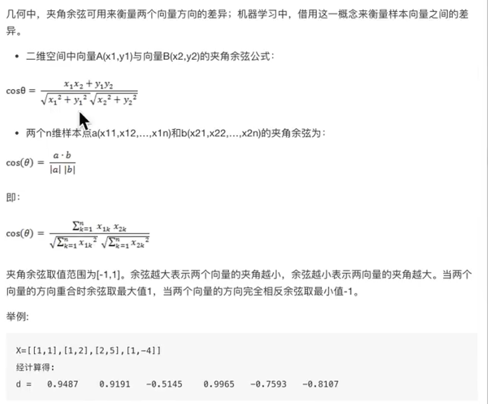
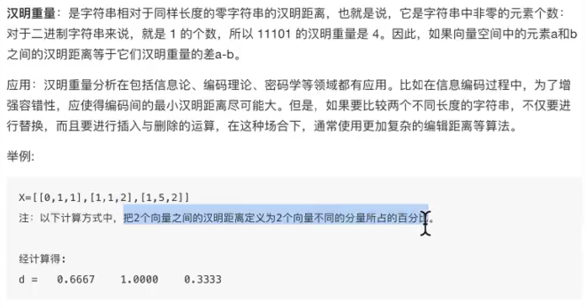
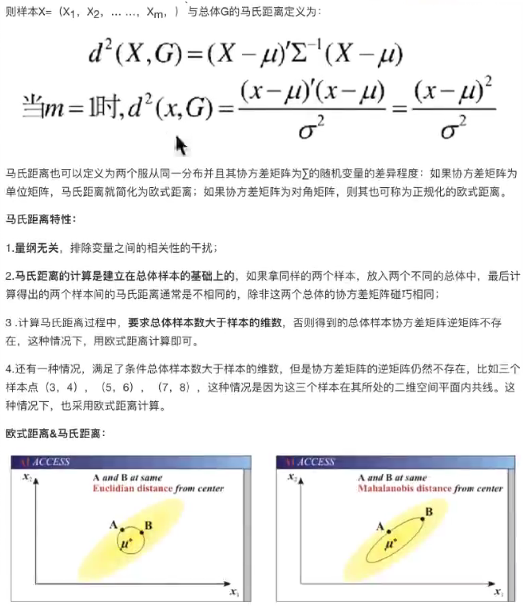
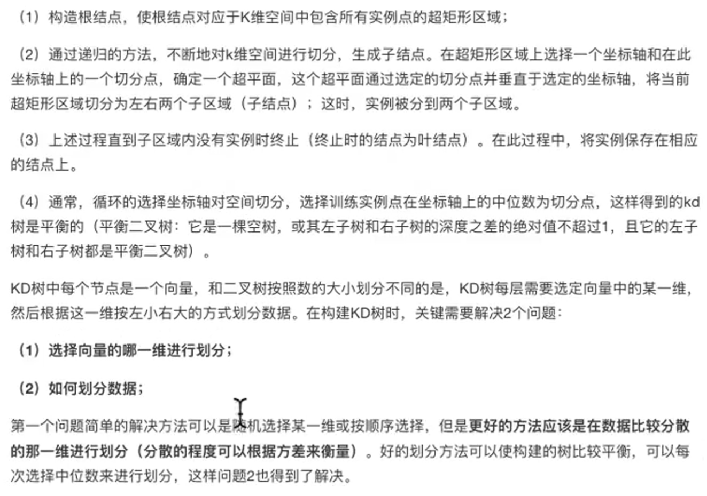

# K-近邻算法(KNN)概念

## 定义：

K Nearest Neighbor算法又叫KNN算法，这个算法是机器学习里面的一个比较经典的算法。

如果一个样本在特征空间中的**K个最相似(特征空间中最邻近)**的样本中的大多数属于某一个类别，则该样本也属于这个类别。

### **距离公式**


样本数据

分别计算每个电影和被预测的电影距离，然后求解


机器学习库：

```
# 使用别人封装好的库
pip install -U scikit-learn
```


### 距离度量:

#### 欧式距离(坐标轴距离)


#### 曼哈顿距离


#### 切比雪夫距离(国际象棋)

只需要走目标值坐标的最大值即可。


#### 闵可夫斯基距离


 量纲不同。

#### 标准化欧式距离


#### 余弦距离

向量算法



#### 汉明距离

主要用来解决

#### 



#### 杰卡德距离


#### 马氏距离




案例


### K值的选择


K值选择问题


### KD树构造


二叉树


树的构造方法



#### 树的建立

从方差大的维度进行切割，说明离散程度高


思路整理


最近领域的搜索


```
1.节点判断
先从一个维度靠近，然后求一次距离r，用r做半径在画圈。
2.回溯
回溯的目的是为了避免有其他节点遗漏，当在半径为R的范围内时，需要不断更新r 的距离，直到有一个最小值r的出现，则可以判断该节点与测试点最相近。
3.结束搜索
通过各个节点到测点的r进行比较，给出测试点的预测特征。
```

