# 决策树算法简介

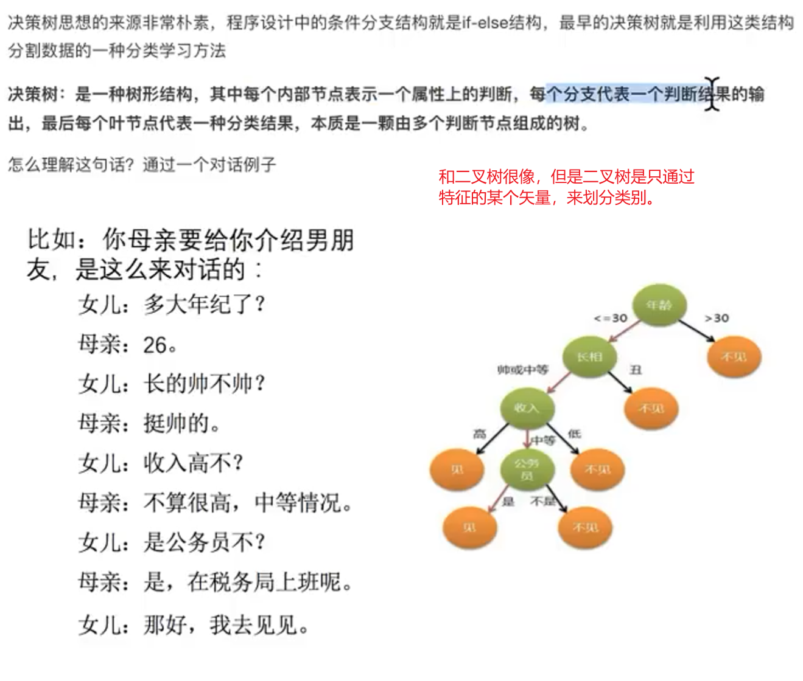

概念来源于信息论中的知识：信息熵，信息增益

信息熵值：描述系统混乱程度的值。

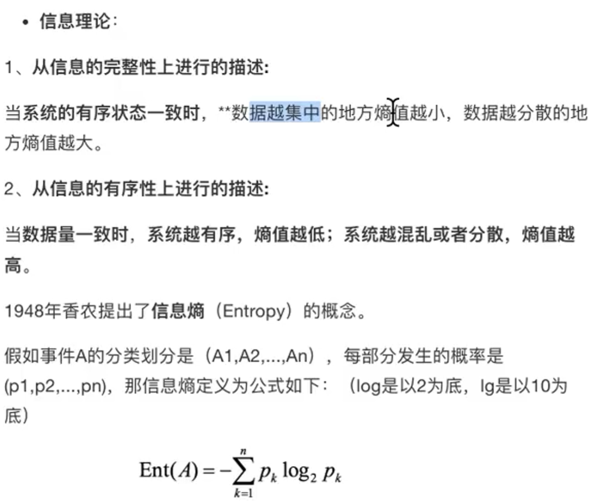

信息增益：以某特征划分数据集前后的熵的差值。

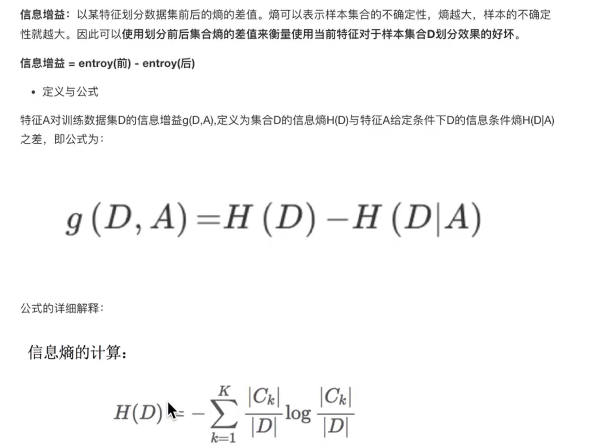

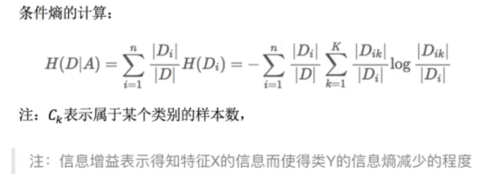

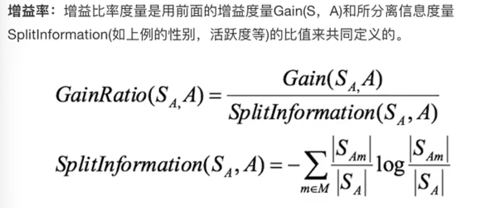

这里需要《机器学习》书本解释

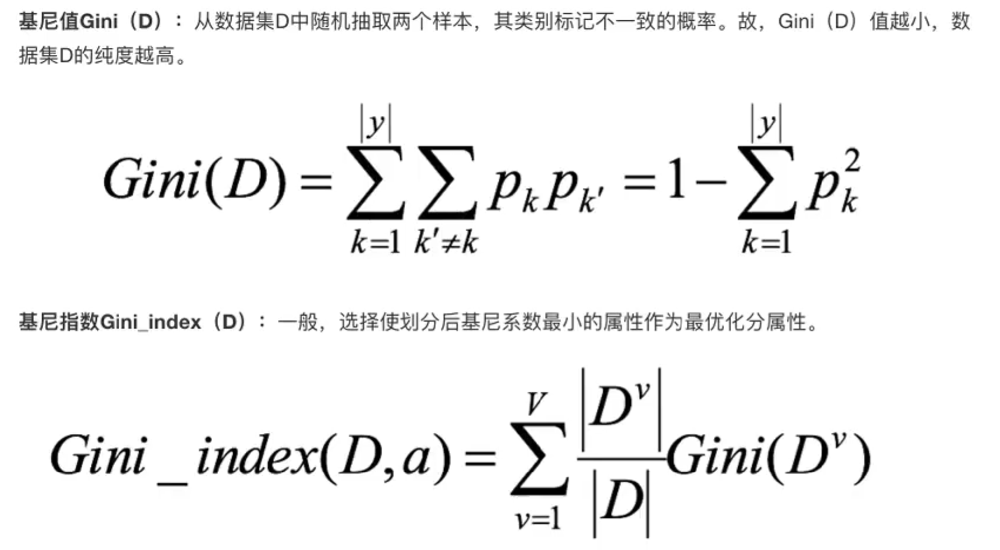

## 总结:

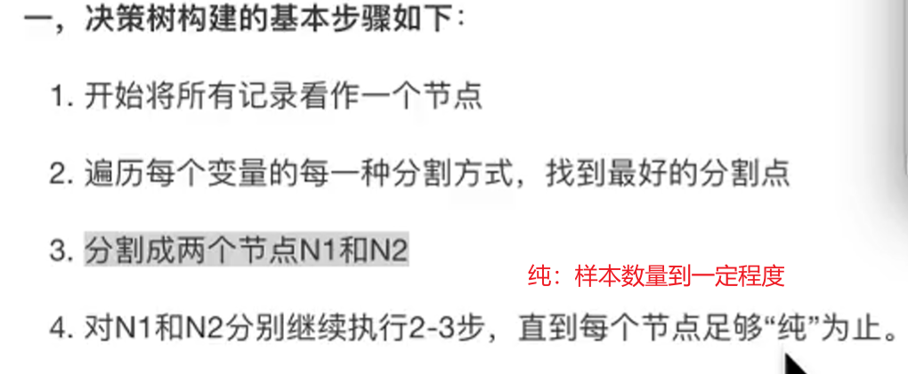

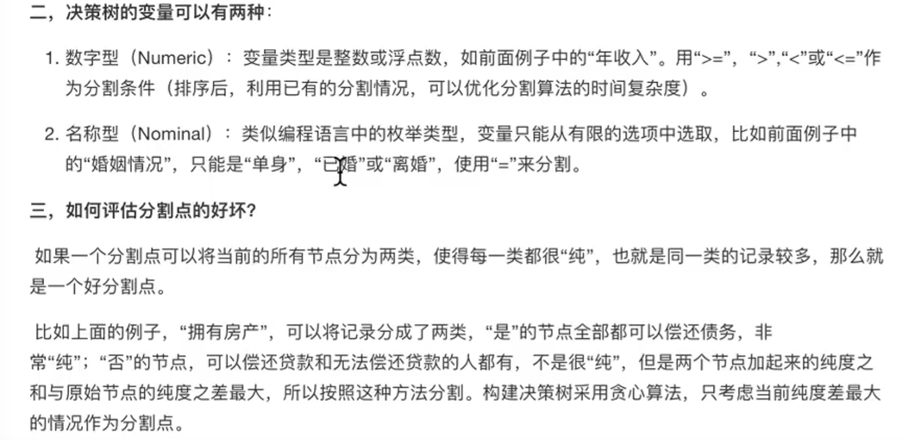

## 常见决策树

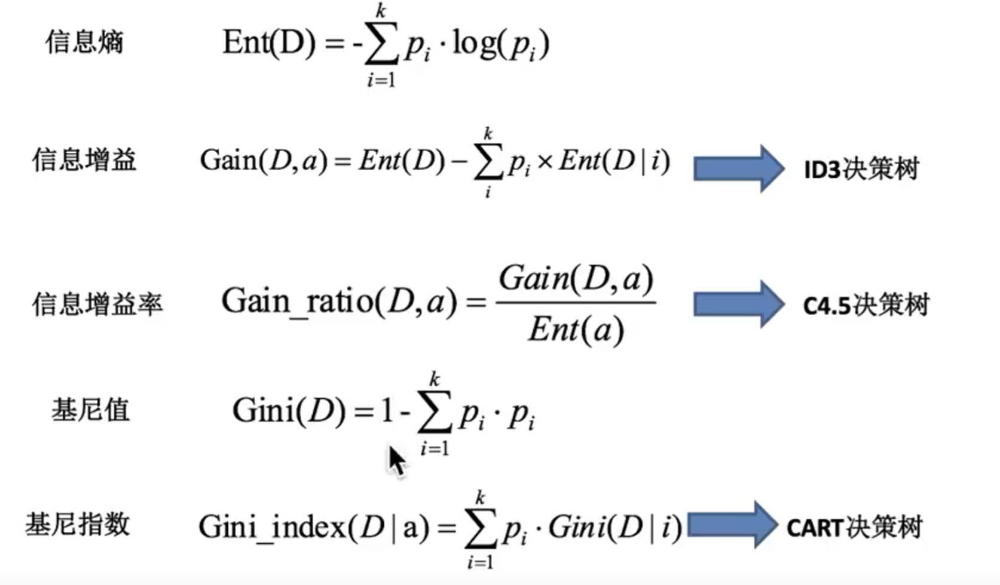

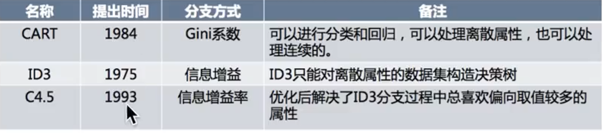

### ID3算法

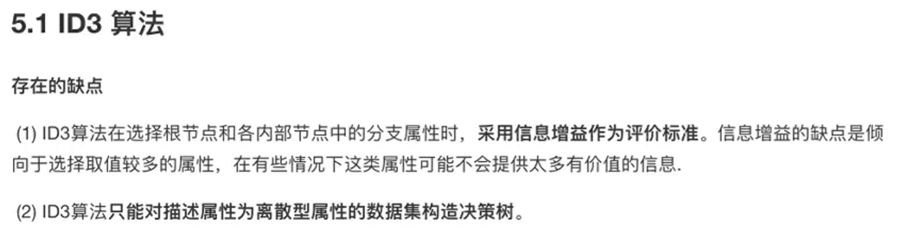

### C4.5算法

### CART算法

## cart剪支

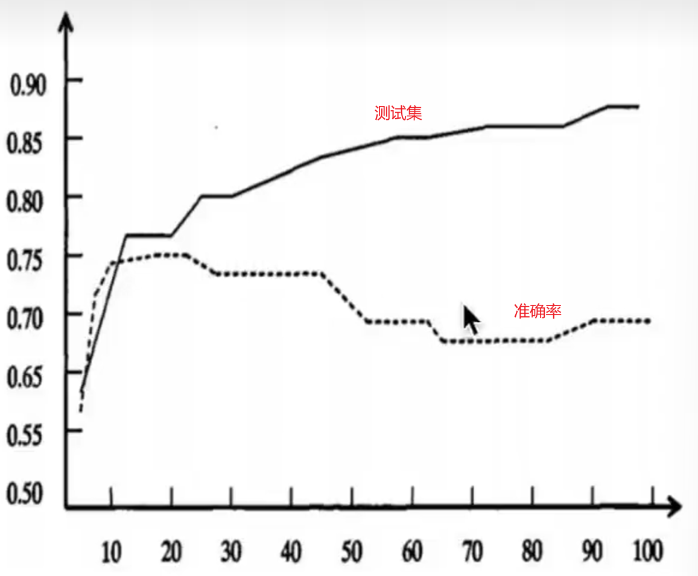

 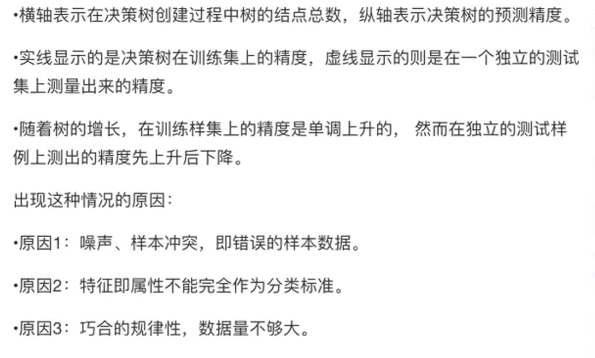

预剪枝：

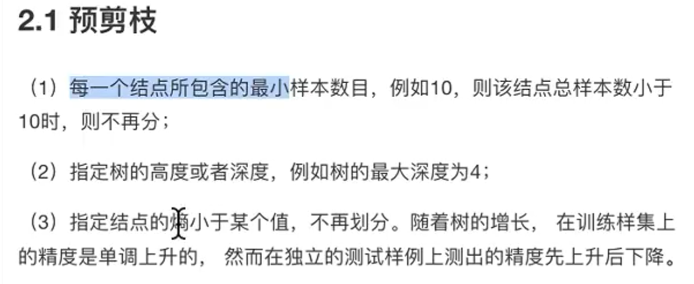

后剪枝:

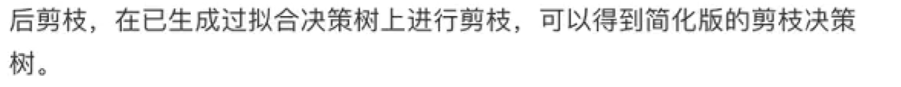

## 特征提取

#### 字典特征提取

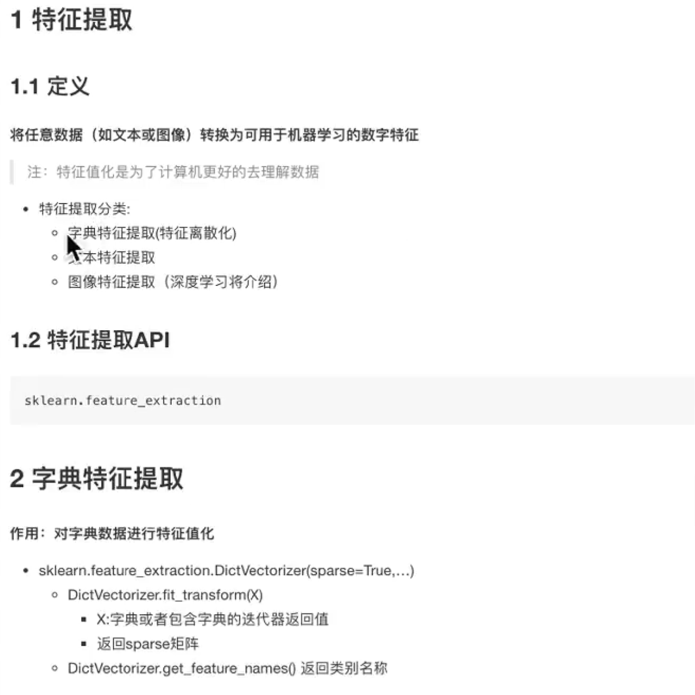

总结：对于特征中存在类别信息的我们都会做one-hot编码

#### 文本特征提取

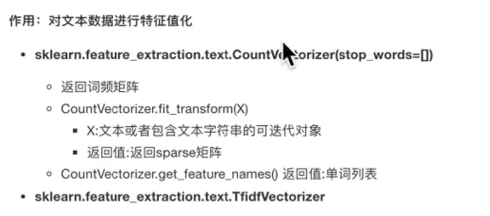

