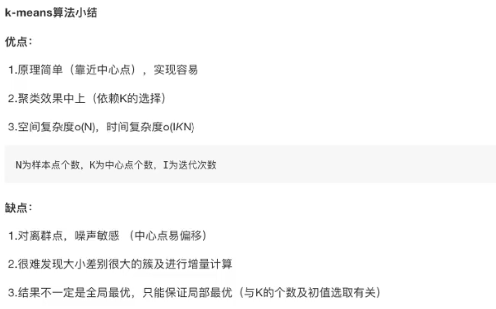
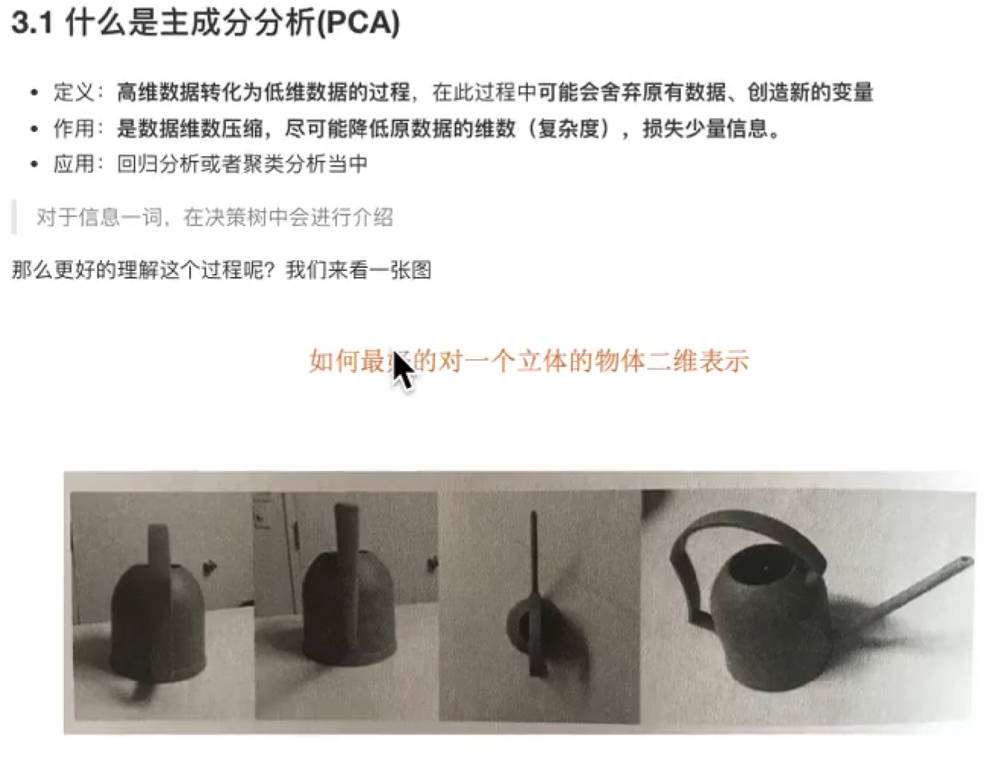

# 聚类算法

## K-means算法原理

聚类，适合无监督学习。

### 使用场景

决策树，集成学习，回归，近邻都是监督学习算法。

### 具体使用方法

### 流程分析

### 聚类算法原理

每次迭代结果不变时，可以认为算法收敛，聚类完毕。

## 模型评估

### 误差平方和

质心的初始值很重要。

### 肘方法

拐点，就是最佳K值

### 轮廓系数法

### CH系数

类别内部数据的协方差越小越好，类别之间的协方差越大越好。

总结：

## 算法优化

### canopy算法配合初始聚类

画同心圆

还是欧式距离做半径，对范围内的样本进行检索。

### K-means++

### 二分K-means

## k-medoids（k中心聚集算法）

让代码更健壮

## kernel k-means算法

## ISODATA算法

## mini batch k-means(大数据算法)

## 总结

## 特征工程+特征降维

### 降维的方式

#### 特征选择

##### 低方差过滤方式

Api

只对特征值进行降维

如果需要更多方式去降维：

我们需要相关系数法

#### 主成分分析

##### PCA分析

##### API

### 案例

