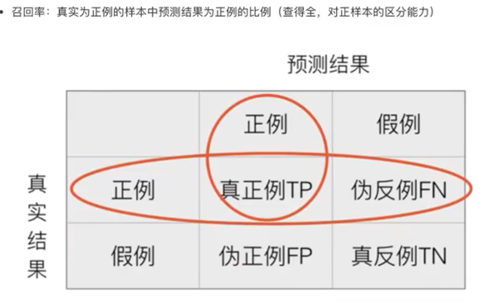

# 逻辑回归算法

## 逻辑回归原理


将线性回归的结果再次进行判断


这个有点经验法的感觉了

## 损失以及优化


### 优化


## 逻辑回归API


## 分类评估方法

### 混淆矩阵（更像是笛卡尔积）


### 准确率和召回率

看查的准不准。。。


看查的全不全



### F1-score

反应模型的稳健性。


F1越接近1，效果越好

### 分类评估报告


## 如果样本不均衡(不满足随机分布)，我们该怎么处理?

使用ROC曲线和AUC指标


### ROC曲线


### AUC计算指标API


### 总结：

```
AUC只能用来评价二分类
AUC非常适合评价样本不平衡的分类器性能
```


查看第一种可能


第二种可能


第三种可能


说白了，就是通过图像面积，进一步了解ROC是什么。。


