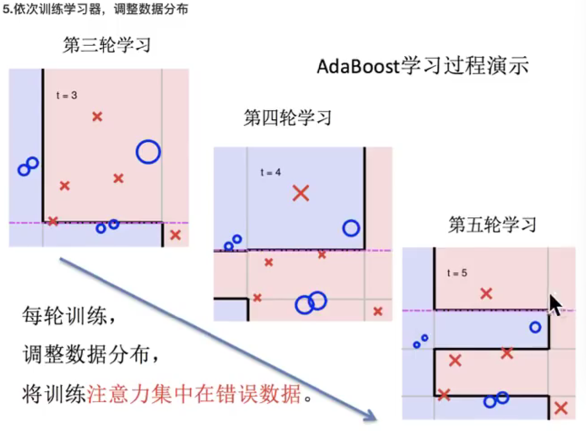

# 集成学习算法

混合算法。

集成学习中的boosting和Bagging

能够提升1%~2%

## Bagging集成原理

1.采样不同的数据

2.训练分类器

3.平权投票

同一份训练集，经过多次训练，得到不同的模型。每个模型输出都是

## 随机森林构造

也是为了解决**过拟合问题**。

就是训练多个决策树，然后对同一份测试集进行判断，多者为真。

### 随机森林API

超参数：无初始值的形参

优缺点：

bagging网格，一份数据使用通过一种算法，生成多个模型。然后对这些模型取平均值，提高模型泛化率

## boosting集成原理

这个就是可以动态添加分类器的模型算法，每加入一个弱学习器，整体能力就可以得到提升。**解决欠拟合。**

###  实现过程:

### 原理：让训练注意到错误数据上

### Api使用

## 两种集成的区别

## GBDT算法

这个就是又加入了一个梯度算法，梯度提升决策树

## XGBoost算法

### 泰勒展开式

最小二乘法（拟合）：  预测值和真实值之差的平方和。

